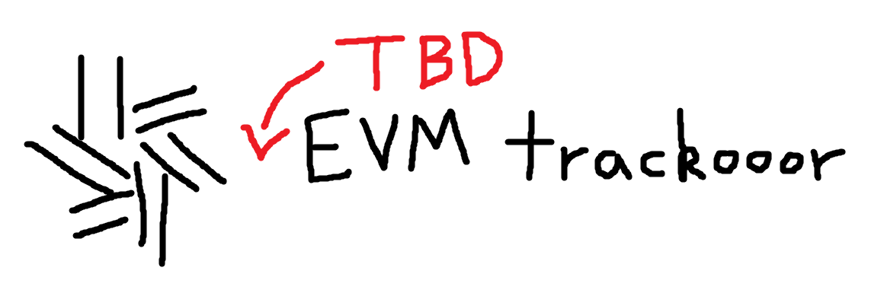
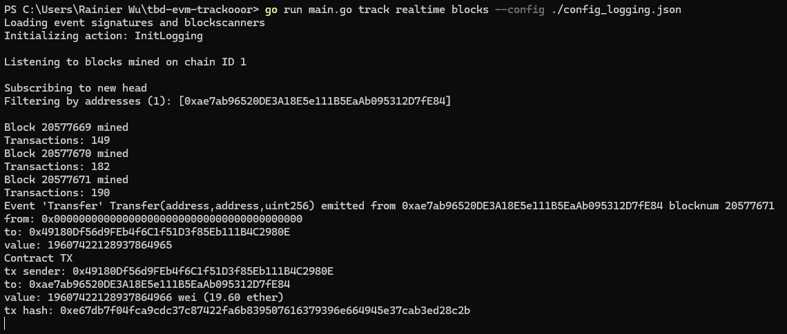
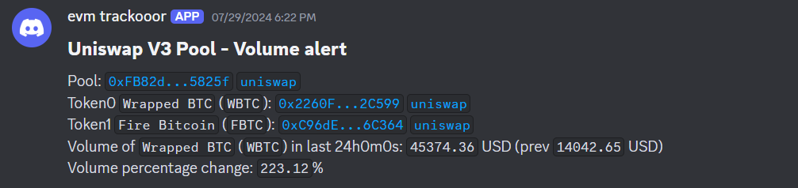
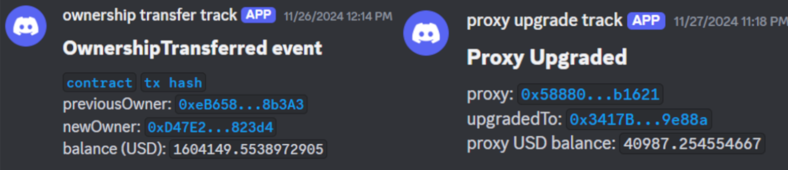
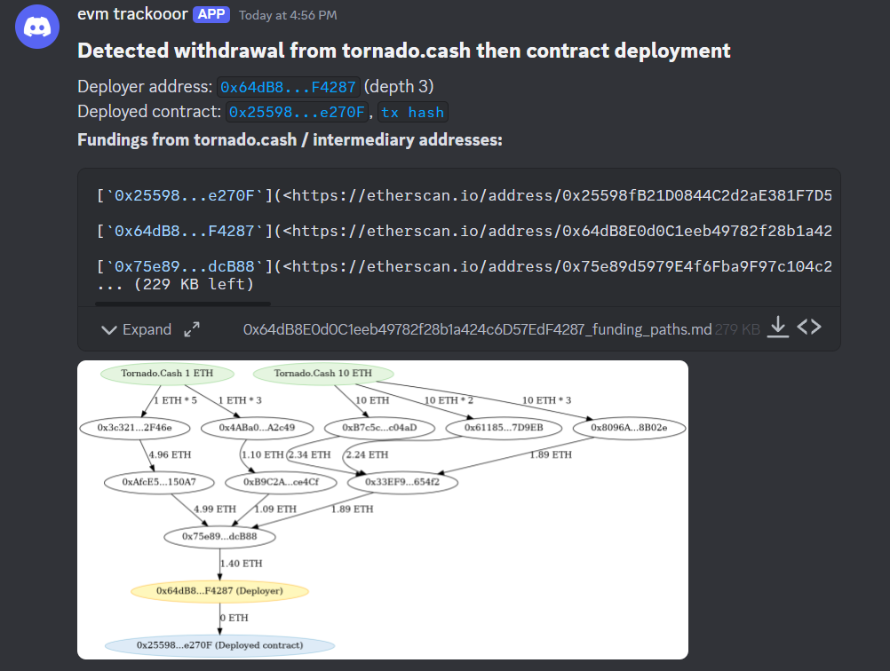
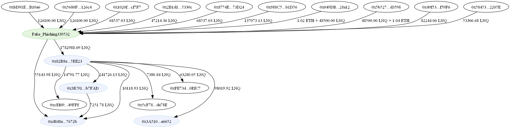

<p align="center">

</p>

# EVM trackooor

A modular tool to track and process anything on an EVM chain, including events, transactions and blocks.

## Table of Contents

- [Examples](#examples)
- [Usage](#usage)
  - [More details](#more-details)
  - [Config file](#config-file)
- [Actions](#actions)
  - [Writing your own actions](#writing-your-own-actions)
- [Data Files](#data-files)
  - [Adding event signature data](#adding-event-signature-data)
  - [Adding function signature data](#adding-function-signature-data)
- [Supported Chains](#supported-chains)
- [Contributions and Support](#contributions-and-support)

# Examples

- Logging events from specific contracts, transactions from specific addresses, and blocks mined, either in realtime or historically
<p align="center">

</p>

- Scanning for contracts deployed by deployment transactions, for specific bytecodes

- Tracking the volume of uniswap v2 & v3 pools, alerting via Discord webhook when there is a significant percentage change
<p align="center">

</p>

- Monitoring for ownership transfers and proxy upgrades
<p align="center">

</p>

- Tracking the common exploit pattern of withdrawing from Tornado.Cash then deploying a contract
<p align="center">

</p>

- Graphing funding paths, for both native ETH and ERC20 tokens to visualize transfers of funds
<p align="center">

</p>

# Usage

Usage:
`go run main.go track <realtime|historical> --config <path to config>`

List [actions](#actions): `go run main.go actions`
- More specific info about an action: `go run main.go actions <search_term>`

## More details

Whether to track events or blocks is automatically determined (based on what data the actions require), but you can also explicitly state what to track by putting `blocks` or `events` after `historical`/`realtime`.

- `events` will use `eth_subscribe` to listen for `logs`, thus only events can be processed
- `blocks` will use `eth_subscribe` to listen for `newHeads`, thus new blocks and transactions in those blocks can be tracked. As for events, another `eth_getFilterLogs` query is used to fetch all events in that block.
  Therefore, `blocks` is recommended as it allows events, txs and blocks to be tracked.

There is also an option for requesting **historical** data across a block range, in which case:

- `events` will use `eth_getFilterLogs` to fetch event logs across multiple blocks, stepping a set amount of blocks at once (default 10000)
- `blocks` will use `eth_getBlockByNumber` to fetch blocks and transactions in those blocks, then another call to `eth_getFilterLogs` for events in that block.
  Therefore, `events` is recommended if only event logs are required, as it is much faster, being able to query a wide range of blocks in a single call.

All events, txs and blocks will be sent to **actions**, which are specified in the config file.


Examples:

- Track a specific contract, logging any transactions to that contract
  - `go run main.go track realtime blocks --config ./config.json`
  - Where in `config.json`, the `Logging` action is used with the contract address in its settings (see [Actions](#actions))
- Loop through blocks 1337 to 2000
  - `go run main.go track historical blocks --config ./config.json --from-block 1337 --to-block 2000`
  - You can also loop backwards (2000 to 1337) by setting `--from-block 2000 --to-block 1337`


## Config file

The config file should contain what [actions](#actions) you want to run, and options for those actions. You should also specify the RPC URL there.

Basic structure:

```json
{
  "rpcurl": "wss://...",
  "actions": {
    "ActionName": {
      "addresses": {
        "0xAA...": { "name": "optional contract name 1" },
        "0xBB...": { "name": "optional contract name 2" }
      },
      "options": {
        "custom-option-1": "something"
      }
    },
    "AnotherAction": {
      "addresses": {
        "0xCC...": { "name": "optional contract name 1" }
      },
      "options": {
        "custom-option-2": "something"
      }
    }
  }
}
```

- `"rpcurl"` must be Websocket (`wss://` or `ws://`)
- `"actions"` contains multiple actions to run, each with their own addresses to track
- Only 1 subscription log is used, therefore in the above example the addresses will be aggregated to form `["0xAA...", "0xBB...", "0xCC..."]`. The same applies for event signatures.
- `"options"` are custom options specific for each action. To see custom options for each action, list all actions (that are documented) using `go run main.go actions`

The example config below logs info for `0xA0b8...` using the `Logging` action, and also records Tornado.Cash deposits/withdrawals for contract `0x910C...` using the `TornadoCash` action:

```json
{
  "rpcurl": "wss://...",
  "actions": {
    "Logging": {
      "addresses": {
        "0xA0b86991c6218b36c1d19D4a2e9Eb0cE3606eB48": {}
      },
      "options": {
        "log-events": true,
        "log-transactions": true,
        "log-blocks": true,
        "log-any-deployments": true,
        "determine-tx-type": false,
        "enable-terminal-logs": true,
        "enable-discord-logs": false,
        "discord-log-options": {
          "webhook-url": "...",
          "username": "evm trackooor",
          "avatar-url": "...",
          "buffer-webhook-messages": true,
          "retry-webhook-messages": false
        }
      },
      "enabled": true
    },
    "TornadoCash": {
      "addresses": {
        "0x910Cbd523D972eb0a6f4cAe4618aD62622b39DbF": {
          "name": "Torando.Cash 10 ETH"
        }
      },
      "options": {
        "output-filepath": "./tornadoCash_out.txt"
      },
      "enabled": true
    }
  }
}
```

There are also options specific to events. You shouldn't need to use these, unless you need to filter by events and it has to be fast. Both of these are optional.
- `"event-signatures"` - List of event signatures (unhashed) to filter by
  - Example: `"event-signatures":["Stored(uint256)", Retrieved(uint256)]`
- `"event-topics"` - Nested list of event topics to filter by. [This](https://pkg.go.dev/github.com/ethereum/go-ethereum@v1.14.3#FilterQuery) explains it better. Event signatures provided from `"event-signatures"` are aggregated with this and placed in the first index as topic 0. 
  - Example: `[[],["0x0000000000000000000000000000000000000000000000000000000000000539"]]`

# Actions

Actions are golang code that 'postprocesses' data received from the trackooor.

Every time there is an event, transaction or block mined, action functions will be called depending on if the data (e.g. event sig, address) is being tracked.

For example, if you want to track transactions from/to an address, you add the address to a **transaction address -> action functions** mapping.

There are already premade actions, such as `Logging`, which simply outputs the data received.

Run `go run main.go actions` to list all actions (that have descriptions written).

Run `go run main.go actions <search_term>` to search for actions and list their custom options and example config.

However, you can write your own actions for your own purposes.

## Writing your own actions

To make your own custom actions, create a file in `actions/`, such as `actions/action_logging.go`.

### Init functions

Each action has an initialization function, which will be called right before the trackooor starts. Registering what to listen for is usually done in this init function. The init function **must start with `Init` and be a method of the `action` type**. After the `Init` word should be your action name. This is important - **your action name must be the same for other special functions** (see [action info](#action-info) and [finished functions](#finished-functions))

For example, `func (p action) InitLogging() {}` is the Init function with action name `Logging`.

The `action` type struct contains action options, which include addresses, event sigs and custom options:

```go
type action struct {
	o shared.ActionOptions
}
```

```go
type ActionOptions struct {
	Addresses     []common.Address       // addresses specific to each action
	EventSigs     []common.Hash          // event sigs specific to each action
	CustomOptions map[string]interface{} // custom options specific to each action
}
```

All of these options will be specified by the user in the config file. The reason `Addresses` and `EventSigs` are separate is because when running the trackooor, there are (usually) multiple actions ran at the same time, thus if using a filter log, the trackooor aggregates addresses and event sigs into a single filter log.

Custom options are JSON inputs by the user in the config file, actions should have their own info on what custom options they require.

Each action is responsible for registering what events/txs/blocks to listen for.

For example, if you wish to call `logTx()` when transactions are receieved from addresses in `Addresses`, you can loop through `Addresses` and call `addTxAddressAction()`:

```go
func (p action) InitLogging() {
    ...
    for _, address := range p.o.Addresses {
		addTxAddressAction(address, logTransaction)
	}
    ...
}
```

There are 5 functions to add tracking for events/txs/blocks:

- Events
  - `addEventSigAction()` adds event sig string to `event sig -> action funcs` map, tracking all events that match that event sig
  - `addAddressEventSigAction()` adds an event sig string and contract address to `contract address -> event sig -> action funcs` map, tracking a specific event from a specific contract
  - `addAddressEventAction()` adds contract address to `contract address -> action funcs` map, essentially calling action functions regardless of event signature
  - WARNING: if your function tries [type-asserting](https://go.dev/tour/methods/15) the event data, it might crash as the field might not exist. For example, anonymous events could have emit `indexed bytes32` and put a keccak hash of a valid event signature, but not actually have the relevant topics/data. As such, when using `addEventSigAction()`, you should first check if the mapping (e.g `p.DecodedTopics["from"]`) exists.
- Transactions and Blocks
  - `addTxAddressAction()` adds an address to `address -> action funcs` map, tracking all transactions to **and** from an address
  - `addBlockAction()` adds an action func to `action funcs` array, which will be called every time a new block is mined

### Action functions

Action functions process the received data.

They can take either event, transaction or block data:

```go
type ActionEventData struct {
	EventLog      types.Log
	EventFields   shared.EventFields
	DecodedTopics map[string]interface{}
	DecodedData   map[string]interface{}
}

type ActionTxData struct {
	Transaction *types.Transaction
	From        *common.Address
	To          *common.Address
	Block       *types.Block // block which the tx was in
}

type ActionBlockData struct {
	Block *types.Block
}
```

For example, checking a transaction calldata takes transaction data, thus `ActionTxData`:

```go
func checkFunctionCall(p ActionTxData) {
	// continue only if tx was contract interaction
	txType := shared.DetermineTxType(p.Transaction, p.Block.Number())
	if txType != shared.ContractTx {
		return
	}

	// get tx To and From
	to := p.To
	from := p.From

	// get tx calldata
	txData := p.Transaction.Data()
	// get tx func selector
	txFuncSig := txData[:4]
    ...
}
```

For `ActionEventData`:

- `EventFields` contains event fields, where each field contains field name, type, and whether that field is indexed
- `DecodedTopics` and `DecodedData` are decoded according to their event ABI, and map the event field name to the value. Topics are indexed fields, while Data are unindexed.
  - E.g. `event Transfer(address indexed from, address indexed to, uint256 value);` will have `from` and `to` in `DecodedTopics` and `value` in `DecodedData`. You will need to type assert them in the action function, such as `to := p.DecodedTopics["to"].(common.Address)`.

For example, processing a ERC20 transfer event:

```go
func ProcessERC20Transfer(p ActionEventData) {
	tokenAddress := p.EventLog.Address
	from := p.DecodedTopics["from"].(common.Address)
	to := p.DecodedTopics["to"].(common.Address)
	value := p.DecodedData["value"].(*big.Int)
    ...
}
```

### Finished Functions

"Finished" functions are called when the trackooor ends, which only happens in historical tracking.

This can be useful for things like saving data to a file after tracking across a certain block range.

Defining a finished function is similar to init functions, where it must be a method of the `action` type, and function name must start with `Finished`. After `Finished` should be the action name, **identical to the init function's action name**.

For example, the `TornadoCash` action will have finisher function `func (p action) FinishedTornadoCash() {}`.

Since action functions are run in async, you should **ensure any time-consuming action funcs have finished before proceeding**.

Example for the `TornadoCash` action:

```go
// function called after historical processor is finished
func (p action) FinishedTornadoCash() {
	// wait for async funcs to finish
	RpcWaitGroup.Wait()
    ...
	err := os.WriteFile(outputFilepath, writeData, 0644)
	if err != nil {
		panic(err)
	}
}
```

### Action Info

Although optional, you should write descriptions on what your action does and what custom options it takes.

You can define an info function, which will be called when running `go run main.go actions` to retrieve the action's info. The **info function name must start with `Info` and be a method of the `actionInfo` type, and return `actionInfo`**.

For example:

```go
func (actionInfo) InfoTrackTornadoFundDeploy() actionInfo {
	name := "TrackTornadoFundDeploy"
	overview := "Tracks Tornado.cash withdrawers and ether transfers by withdrawers. " +
		"Alerts if tracked address deploys a contract."

	description := "This is done by listening to withdraw events of all Tornado.cash contracts, " +
		"and adding the withdraw `to` field to tracked addresses. " +
		"Ether transfers from tracked addresses will add the ether recipient to tracked addresses. " +
		"Any subsequent contract deployments will alert in the webhook and terminal."

	options := `"data-filepath" - path to save data to
"webhook-url" - Discord webhook URL for alerts
"eth-transfer-threshold" - Min amount of eth transfers to an address for it to be tracked, units in wei
"max-eth-transfer-depth" - Maximum depth to keep tracking eth transfers
"data-retention-period" - Will only consider data in the last X hours. Note that data won't be deleted, but only deployments that had a funding path less than this time will be logged`

	example := `"TrackTornadoFundDeploy": {
    "addresses": {
        "0x12D66f87A04A9E220743712cE6d9bB1B5616B8Fc": {"name": "Tornado.Cash 0.1 ETH"},
    },
    "options":{
        "webhook-url":"https://discord.com/api/webhooks/...",
        "data-filepath":"./tornado_data.json",
        "eth-transfer-threshold":"1000000000000000000",
        "max-eth-transfer-depth":3,
        "data-retention-period":"24h"
    }
}`

	return actionInfo{
		ActionName:          name,
		ActionOverview:      overview,
		ActionDescription:   description,
		ActionOptionDetails: options,
		ActionConfigExample: example,
	}
}
```

The action name and overview will be displayed when running `actions`, and all other detail displayed when running `actions <search_term>` such as `actions tornado`. 

### Additional Info

If you wish to perform further RPC calls within action files, you can use `shared.Client` as the [ethclient](https://pkg.go.dev/github.com/ethereum/go-ethereum/ethclient) Client.

For example, the BytecodeScan action retrieves a contract's code using `shared.Client.CodeAt()` as shown below.

```go
func blockMined(p ActionBlockData) {
	block := p.Block
	for _, tx := range block.Transactions() {
		  ...
			deployedContract, _ := shared.GetDeployedContractAddress(tx)
			contractCode, err := shared.Client.CodeAt(context.Background(), deployedContract, block.Number())
			...
	}
}
```

If you want a whole block to be processed before querying for the next block, usually for historical trackooors, you can add use the wait group `shared.BlockWaitGroup`. For example, if your action performs time consuming tasks when a block is mined, you may want to wait for the task to finish before querying the next block.

# Data Files

Data files exist in `data/`, and contain info on event signatures, and blockscanners.

It also contains function signatures, although this is not needed normally, some actions might require it.

`event_sigs.json`

- Contains event signature hashes, mapped to the event's name, signature and ABI. The event ABI is crucial for decoding the event fields.
- Most of the time you don't need to add this manually. See flag `--fetch-abi`
<details>
<summary>Example for ERC20 Transfer event</summary>

```json
{
  "0xddf252ad1be2c89b69c2b068fc378daa952ba7f163c4a11628f55a4df523b3ef": {
    "abi": {
      "anonymous": false,
      "inputs": [
        {
          "indexed": true,
          "internalType": "address",
          "name": "from",
          "type": "address"
        },
        {
          "indexed": true,
          "internalType": "address",
          "name": "to",
          "type": "address"
        },
        {
          "indexed": false,
          "internalType": "uint256",
          "name": "value",
          "type": "uint256"
        }
      ],
      "name": "Transfer",
      "type": "event"
    },
    "name": "Transfer",
    "sig": "Transfer(address,address,uint256)"
  }
}
```

</details>

`blockscanners.json`

- Such as Etherscan, for automatically retrieving verified contract's ABIs to extract their event signatures.
- Also used for formatting blockscanner URLs for nice hyperlink output in webhooks

<details>
<summary>Example for Ethereum Mainnet (Chain ID 1)</summary>

```json
{
  "1": {
    "address": "https://etherscan.io/address/%v",
    "token": "https://etherscan.io/token/%v",
    "block": "https://etherscan.io/block/%v",
    "transaction": "https://etherscan.io/tx/%v",
    "contract-abi": "https://api.etherscan.io/api?module=contract&action=getabi&address=%v&format=raw"
  }
}
```

</details>

## Adding event signature data

Most of the time you won't need to add event signatures manually, as you can set `--fetch-abi` which will automatically pull the event ABIs from the blockscanner and use that, if the source code is available. You may need to specify an API key.

Otherwise, you can either:

- Run `go run main.go data event --abi <path_to_contract_abi>` to extract event sigs from the provided contract ABI file
- Or run `go run main.go data event --contract <contract_address> --chain <chain_id>` to extract event sigs using source code on blockscanners given contract address and the Chain ID it is deployed on
  - This may require blockscanner API keys which you can add in the `blockscanners.json` URL (`https://api.etherscan.io/api?module=contract&action=getabi&address=%v&format=raw&apikey=...`)

## Adding function signature data

Same process as adding event data:

- Run `go run main.go data func --abi <path_to_contract_abi>` to extract func sigs from the provided contract ABI file
- Or run `go run main.go data func --contract <contract_address> --chain <chain_id>` to extract func sigs using source code on blockscanners given contract address and the Chain ID it is deployed on
  - This may require blockscanner API keys which you can add in the `blockscanners.json` URL (`&apikey=...`)

# Supported Chains

The evm trackooor can be used with **any EVM compatible chain**, such as Ethereum Mainnet, Base, Optimism, Arbitrum, etc.

## Not-quite-EVM L2 Chains

For L2 chains that aren't exactly "EVM compatible", for example having invalid system TX hashes (like Blast), you can specify an option `"l2":true` in the config to use a hacky method to fetch L2 blocks without errors. However, this will cause transactions with system/invalid TX types to be ignored.

# Contributions and Support

Feel free to contribute! Any questions / bugs, please create an issue, or message/ping me (`thesavageteddy`) on Discord.
